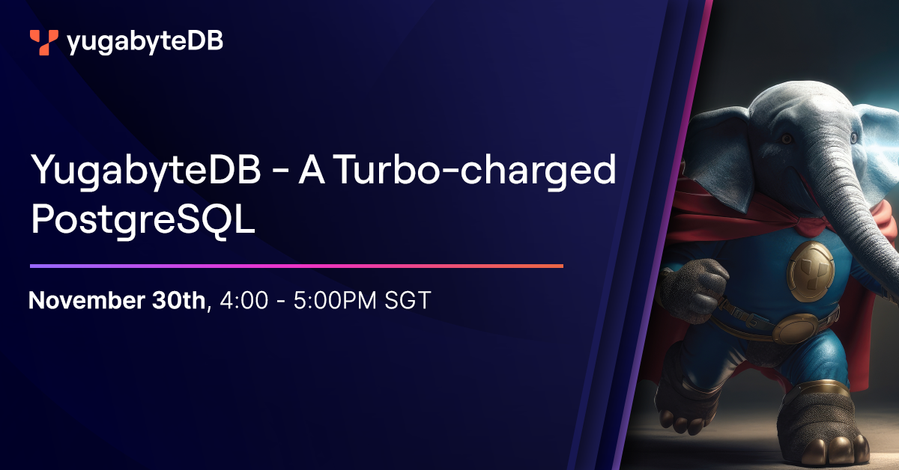

# YugabtyeDB - A Turbo-charge PostgreSQL


## Ecosystem - Application Developer

### Gitpod

[![Open in Gitpod][logo-gitpod]][gp-main]

Minimal configuration for `.gitpod.yml` to use yugabytedb is:

```yaml
image: gitpod/workspace-yugabytedb:latest

tasks:
  - name: yugabyted-start
    command: |
      mkdir -p ${GITPOD_REPO_ROOT}/ybdb
      yugabyted start --base_dir=${GITPOD_REPO_ROOT}/ybdb/ybd1 --advertise_address=127.0.0.1 --cloud_location=ybcloud.pandora.az1 --fault_tolerance=zone
      yugabyted start --base_dir=${GITPOD_REPO_ROOT}/ybdb/ybd2 --advertise_address=127.0.0.2 --cloud_location=ybcloud.pandora.az2 --fault_tolerance=zone --join=127.0.0.1
      yugabyted start --base_dir=${GITPOD_REPO_ROOT}/ybdb/ybd3 --advertise_address=127.0.0.3 --cloud_location=ybcloud.pandora.az3 --fault_tolerance=zone --join=127.0.0.1
      yugabyted configure data_placement --fault_tolerance=zone --base_dir=${GITPOD_REPO_ROOT}/ybdb/ybd1
      gp sync-done ybdb

  - name: ysqlsh
    command: |
      gp sync-await ybdb && gp ports await 5433 && sleep 2
      ysqlsh
  
  - name: ycqlsh
    command: |
      gp sync-await ybdb && gp ports await 9042 && sleep 2
      ycqlsh

ports:
  - name: yugabyted-ui
    description: YugabyteDB UI
    port: 15433
    onOpen: ignore
  - name: yugabyted-master
    description: YugabyteDB Master UI
    port: 7000
    onOpen: ignore
  - name: yugabyted-tserver
    description: YugabyteDB Tserver UI
    port: 9000
    onOpen: ignore
```

This configuration:
1. Uses `gitpod/workspace-yugabytedb` image, so yugabytedb binaries are ready to run
1. Start a three node yugabytedb cluster. You can skip this if you do not want to create a 3 node cluster
1. Create shells for `ysql` and `ycql`. You can skip this if you have skipped creating cluster


[logo-gitpod]: https://gitpod.io/button/open-in-gitpod.svg
[gp-main]: https://gitpod.io/#https://github.com/yogendra/yb-apj-webinar-tcpg

